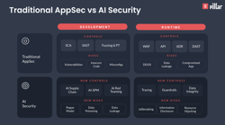
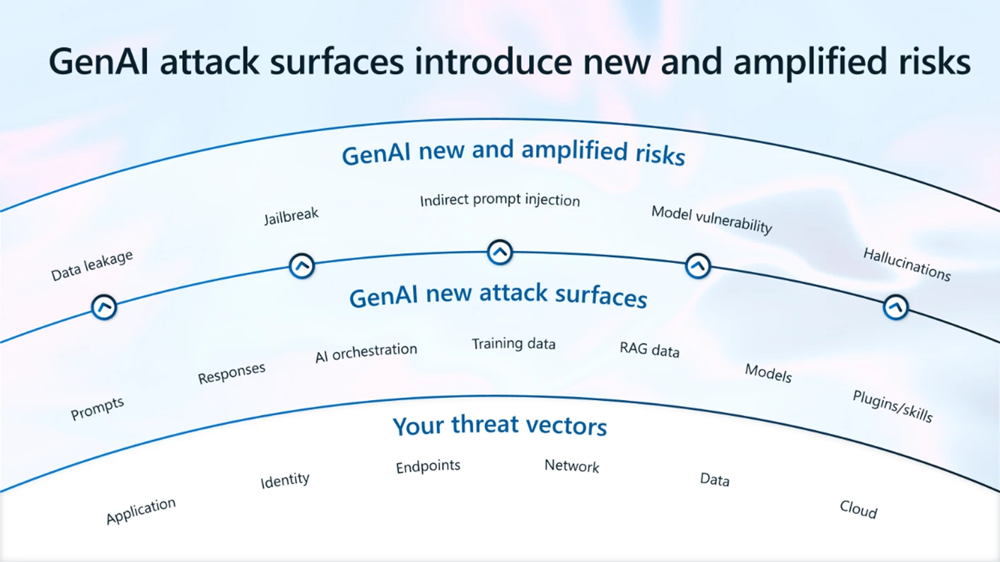
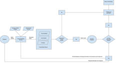

# Introduction — Framing Secure GenAI and ML - TechBlog - Confluence

## PDF Metadata

- **Title:** Introduction — Framing Secure GenAI and ML - TechBlog - Confluence
- **Creator:** Mozilla/5.0 (X11; Linux x86_64) AppleWebKit/537.36 (KHTML, like Gecko) HeadlessChrome/147.0.0.0 Safari/537.36
- **Producer:** Skia/PDF m147
- **CreationDate:** Thu Apr 30 20:42:04 2026 PDT
- **ModDate:** Thu Apr 30 20:42:04 2026 PDT
- **Custom Metadata:** no
- **Metadata Stream:** no
- **Tagged:** yes
- **UserProperties:** no
- **Suspects:** no
- **Form:** none
- **JavaScript:** no
- **Pages:** 3
- **Encrypted:** no
- **Page size:** 612 x 792 pts (letter)
- **Page rot:** 0
- **File size:** 661028 bytes
- **Optimized:** no
- **PDF version:** 1.4

<!-- Page 1 -->

## Page 1

### Extracted Images




```text
Introduction — Framing Secure GenAI and ML
  Purpose and Scope
  From Exploit-First to Threat-Model–First
  Why GenAI Security Is Different
  What This Document Covers
  Guiding Principles
  Intended Audience


Purpose and Scope

Generative AI (GenAI) and Machine Learning (ML) systems introduce a fundamentally different
security model from traditional software applications. While they are often deployed within
familiar architectures—APIs, microservices, cloud platforms—their core execution logic is
probabilistic, data-driven, and adaptive, rather than deterministic and code-defined. This shift
requires a corresponding shift in how security is analyzed, designed, and operated.
This document presents a structured approach to Secure GenAI and ML, derived from
established training (SANS - SEC545 GenAI and LLM Application Security) and research
material for internal knowledge transfer. The goal is to explain why GenAI systems fail, where
the attack surface originates, and how security controls must adapt.


From Exploit-First to Threat-Model–First

Much existing GenAI security material is organized bottom-up: individual attacks, proofs of
concept, and lab-style exploitation. While valuable, this approach can obscure the underlying
causes of risk.
This work intentionally adopts a top-down methodology:
1. Threat modeling first – identify assets, trust boundaries, and influence paths
2. Attack surface validation – understand where inputs can shape behavior
3. Architectural differentiation – clarify how GenAI diverges from traditional applications
4. Targeted attack analysis – examine techniques only in their architectural context
```

<!-- Page 2 -->

## Page 2

### Extracted Images




```text
This shift allows security practitioners to reason about entire classes of failures, rather than
isolated vulnerabilities.
Why GenAI Security Is Different

Traditional application security assumes:
  Code defines behavior
  Inputs are validated data
  Control flow is explicit and testable
  Security failures are repeatable
GenAI systems break these assumptions:
  Prompts act as a control plane
  Data can function as executable logic
  Behavior emerges from model inference, not code paths
  The same input may not produce the same output
As a result, GenAI security focuses less on “where is the bug” and more on “who can influence
the model, through which channels, and with what authority.”


What This Document Covers

This work is organized into three major sections:
1. Securing GenAI Applications
   Architecture patterns (RAG, agentic systems, fine-tuning), their internal logic, and associated
   attack surfaces.
2. Securing the GenAI Application Lifecycle
   How data, models, prompts, and feedback loops extend the traditional SDLC and introduce
   new risks.
3. MLSecOps
   Operational security for models and ML pipelines, and how it differs from—but builds upon—
   DevSecOps.
Each section integrates threat-model templates, architectural reasoning, and security
principles that scale across implementations.
```

<!-- Page 3 -->

## Page 3

### Extracted Images




```text
Guiding Principles

Throughout this document, several principles apply consistently:
  Treat models, prompts, and data as first-class security artifacts
  Assume misuse and manipulation, not just bugs
  Design for human-in-the-loop oversight
  Monitor behavior and semantics, not only logs and metrics
  Accept that non-determinism is a security property, not a defect


Intended Audience

This material is intended for:
  Security architects and AppSec engineers
  ML and platform engineers
  Cloud and infrastructure security teams
  Governance, risk, and compliance stakeholders
It assumes familiarity with general application security concepts, but does not require prior
expertise in machine learning.
```

## Extraction Notes

- Text was extracted with `pdftotext -layout` to preserve visible reading order and spacing as closely as Markdown allows.
- Embedded images were extracted with `pdfimages -png` and referenced near their source pages.
- PDF layout, fonts, exact coordinates, and styling cannot be represented perfectly in Markdown.

Source: `materials/EMO-Introduction — Framing Secure GenAI and ML-010526-034204.pdf`
