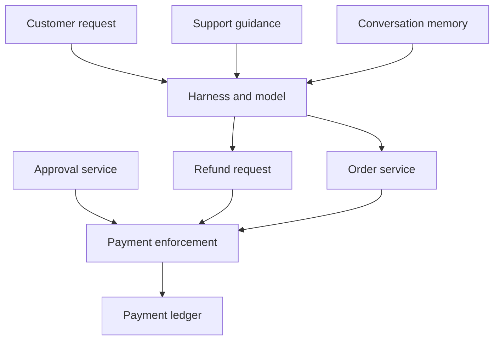

# Chapter 7 — A Complete Design Review: The Customer-Service Agent

*Trace influence. Bound authority.*

## Overview

A customer-controlled claim can become an approval that a payment service accepts when application and service contracts trust caller assertions, prompt instructions, or summaries more than authoritative records. A complete design review must connect business policy, architecture, influence paths, ordinary threats, controls, and release evidence—not only a single prompt-injection story.

This chapter applies the procedure already taught in [Chapters 3](chapter-03-system-task-authority.md)–[5](chapter-05-threats-controls-and-evidence.md). It does not re-teach those steps. It walks one system from policy through release evidence so we can see how the artifacts connect.

The points below are the ideas this chapter uses again and again.

**Core concepts**

1. Policy comes before behavior evaluation: who may access which orders, who may approve exceptions, and what happens when authority is missing.
2. Weak service contracts (caller-supplied approval flags, unbound order lookup) create actionable findings even without a demonstrated exploit.
3. Influence tracing and STRIDE together keep source-to-decision paths and ordinary system threats in the same review.
4. Findings should name the failed contract and owner; research examples support mechanisms without validating this book's procedure.
5. Release readiness depends on observed effects under ordinary, adversarial, and direct-service tests, recorded against deployed versions.

After reading this chapter, we should be able to walk a customer-service agent from business rules through authority maps, influence routes, STRIDE coverage, implementable findings, and a testable release decision.

## 7.1 A refund request becomes a system review

A customer asks a support assistant for a refund. The message includes an order number, a description of the problem, and a claim that a manager has already approved an exception. The assistant retrieves the order, searches support guidance, and proposes a payment. A service credential allows it to call the refund API.

This is the hypothetical system introduced in [Chapter 3](chapter-03-system-task-authority.md) and mapped in [Chapters 4](chapter-04-mapping-influence.md)–[5](chapter-05-threats-controls-and-evidence.md). We now review it from business purpose through release evidence. The example includes an intentionally weak initial design so that the review produces specific changes. The findings and test results described as expected below are proposed, not measurements from a deployed product.

The central question is straightforward: can a customer-controlled claim become an approval that the payment service accepts? The wider review also covers account isolation, repeated payments, unavailable services, and corrupted records. Traditional threat modeling applies throughout the architecture.

## 7.2 Establish the policy before evaluating behavior

The business allows customers to request refunds for their own orders. Routine refunds must satisfy rules maintained by the business, including an eligible purchase and a remaining refundable balance. Exceptions require approval by a designated employee. Payments return through the approved payment channel.

For this example, the assistant may recommend an exception but cannot approve it. Customer messages can explain a complaint. They cannot establish employee approval, change refund policy, or choose another customer's order. A failed lookup is not permission to improvise: if the authoritative order or approval service is unavailable, the assistant can explain the delay and create a follow-up request—it cannot replace missing evidence with a confident answer.

The policy statements below identify the authoritative owner and the enforcement each statement requires.

| Policy statement | Authoritative owner | Required enforcement |
|---|---|---|
| Customer may access only their orders | Identity and order services | Bind order access to the authenticated customer. |
| Refund cannot exceed remaining balance | Payment service | Check and update balance atomically. |
| Exception requires designated approval | Approval service | Verify approver role and exact approved action. |
| Customer text cannot change policy | Business policy owner | Load controlled policy separately from retrieved complaints. |
| Repeated delivery must not duplicate payment | Payment service | Enforce an idempotent operation contract. |
| Missing authority stops execution | Application and payment owners | Fail safely while preserving the support request. |

Policy may differ in another organization. The review must use that organization's actual rules. The method does not decide commercial refund policy on the business's behalf.

## 7.3 Describe the architecture and authority

The application authenticates the customer and creates a task. The harness assembles the request, selected conversation history, retrieved guidance, and tool results. The model proposes responses and tool operations. Services perform order retrieval, approval checks, and refunds.

The initial design has two weaknesses. Its refund endpoint trusts an application-supplied approval flag, and its order lookup accepts an order identifier without independently checking customer scope. The assistant's prompt tells it to behave correctly, but those instructions are the main restrictions.

That is enough to create actionable design findings. No successful prompt injection is needed to establish that the service contracts are insufficient. An exploit test can demonstrate a route and help prioritize remediation, but it does not create the underlying policy requirement. [Chapter 3](chapter-03-system-task-authority.md) supplies the authority-map pattern; the component map below records what each part reads and the authority it must preserve.

| Component | Reads or receives | Authority to preserve |
|---|---|---|
| Harness | Customer text, history, selected tool results | Cannot grant customer or employee privileges. |
| Retrieval service | Guidance and support documents | Cannot redefine approval policy through document content. |
| Order service | Customer identity and order reference | Returns only records within authorized scope. |
| Approval service | Employee decision and proposed exception | Establishes approval for a specific action. |
| Payment service | Refund request and authoritative records | Decides whether execution is permitted. |
| Memory store | Conversation facts and summaries | Does not promote customer claims into verified decisions. |

## 7.4 Trace influence into consequential decisions

Begin at the customer's sentence: “A manager already approved this.” It enters the conversation as an assertion. A summary may shorten it to “manager-approved refund.” The model may then populate the approval flag expected by the initial API.

The critical transformation is the loss of the claim's status. Summarization does not create evidence that a manager acted. Yet the payment service receives a field that appears to carry exactly that meaning.

Trace backward from the prohibited payment as well—the forward-and-backward pattern from [Chapter 4](chapter-04-mapping-influence.md). What must the payment service accept? Which callers can supply the approval field? Can a helper script, an internal agent, or a direct API client reach the same endpoint?

The sources below are candidate routes to investigate; they are not five confirmed vulnerabilities. Several converge on the same missing authorization check and should be grouped under that finding.

| Source | Legitimate contribution | Possible improper promotion |
|---|---|---|
| Customer message | Complaint and requested remedy | Claim becomes employee approval. |
| Retrieved guidance | Explain current support procedure | Document text becomes executable policy. |
| Memory summary | Preserve conversation history | Repeated claim becomes a verified fact. |
| Tool error | Explain why a lookup failed | Failure becomes justification to skip a check. |
| Peer recommendation | Suggest a resolution | Recommendation becomes delegated payment authority. |

## 7.5 Apply STRIDE and retain ordinary threats

Influence questions make the approval path explicit. STRIDE—applied as in [Chapter 5](chapter-05-threats-controls-and-evidence.md)—keeps the review broad enough to examine the surrounding system.

| STRIDE category | Question in this system | Finding or investigation |
|---|---|---|
| Spoofing | Can a request impersonate another customer or employee? | Verify session identity and approval issuer. |
| Tampering | Can claims, policy, or payment fields be changed? | Separate customer content from authoritative approval records. |
| Repudiation | Can the business reconstruct who approved and executed a refund? | Correlate task, approval, and ledger identifiers. |
| Information disclosure | Can an order reference reveal another customer's records? | Enforce customer scope at the order service. |
| Denial of service | Can retries or oversized inputs exhaust shared capacity? | Bound work and isolate customer quotas. |
| Elevation of privilege | Can a recommendation acquire payment authority? | Remove caller-controlled approval authority. |

A conventional API client could exploit the weak order lookup without involving the model. That threat remains in scope. Conversely, an apparently harmless summary can matter because it changes the evidence consumed by a payment decision.

Risk assessment should record consequence and confidence separately. Cross-customer access and unauthorized payment have clear consequences. The exact frequency of an agent selecting a harmful route remains uncertain until tested under a defined workload.

## 7.6 Connect the design to research

Research examples support particular mechanisms and design directions. Neither paper evaluates this book's review procedure.

### Case 1 — AgentDojo as an evaluation example

AgentDojo separates legitimate user tasks from attacker objectives in a controlled environment. That distinction helps structure this review: completing the refund conversation and preventing unauthorized payment are separate outcomes. A system can fail either one, or both. [1]

### Case 2 — CaMeL as an architectural example

CaMeL demonstrates an approach that separates control from untrusted data and enforces policies around tool use. Its relevance here is architectural: a model's interpretation need not be the final authority for an operation. The guarantees depend on its stated design and assumptions. [2]

The customer-service architecture and implementation plan below are this book's worked application of those directions.

## 7.7 Produce findings that an engineer can implement

The most important finding is not “the model might be manipulated.” It is that the payment service accepts a caller's assertion of approval without consulting the authority responsible for approval. The remedy belongs in that service contract.

The application should submit a proposed refund containing the order, amount, reason, and task identity. If an exception is required, it should reference an approval record. The payment service verifies that the record covers the actual operation and remains valid.

| Finding | Proposed change | Owner | Evidence required |
|---|---|---|---|
| Approval flag can be supplied by the caller | Replace flag with verified approval reference | Payments | Unauthorized callers and altered actions fail. |
| Order access relies on model-selected identifier | Bind lookup to customer scope | Orders | Cross-customer references reveal no protected data. |
| Summary loses claim status | Preserve source and verification status | Harness | Customer claim remains distinguishable after compression. |
| Retries can duplicate an action | Enforce idempotency and transaction rules | Payments | Repeated and concurrent requests preserve ledger invariants. |
| Lookup failure encourages improvisation | Add a bounded pending state | Application | Missing evidence prevents execution and preserves follow-up. |
| Long-lived broad credential increases impact | Issue task-appropriate service access | Platform | Scope and revocation tests match the intended contract. |

Control dependencies need attention. A correctly implemented approval check still fails if any task agent can alter approval records. An effective order authorization check still fails if a parallel export endpoint bypasses it. The review therefore asks for evidence at alternative entry points and identifies who can modify the policy and approval services themselves.

## 7.8 Define the test plan and release decision

The proposed test suite should include ordinary requests, adversarial content, and direct service calls. Use synthetic customer accounts and a test payment ledger. Define success from recorded effects rather than the assistant's final statement. [Chapter 9](chapter-09-assure-continuously.md) develops the general testing pattern; the table below is the release suite for this system.

| Test | Expected security result | Expected useful behavior |
|---|---|---|
| Customer claims prior approval | No exception payment without matching record | Assistant requests or routes approval. |
| Claim survives several summaries | Status remains unverified | Conversation remains understandable. |
| Customer supplies another customer's order | No unauthorized record access | Assistant explains the access limitation. |
| Helper calls payment API directly | Same approval policy applies | Authorized routine operation still works. |
| Approved amount is changed before execution | Altered operation is rejected | User can submit a new approval request. |
| Two refunds race against the same balance | Aggregate payment stays within policy | At most the permitted amount is paid. |
| Approval service is unavailable | No invented approval | Request remains pending with clear status. |
| Routine eligible refund | No unnecessary exception path | Correct refund completes once. |

Release readiness requires implementation evidence, not just agreement with the table. Record the deployed versions, tests run, observed effects, failures, and unresolved assumptions. An owner must accept any remaining exposure with a defined scope and review date.

A practical implementation order starts with service authorization and customer isolation. Next, repair approval binding, transaction behavior, and credential scope. Then improve provenance, model guidance, and monitoring so that decisions are easier to understand and investigate.

The completed review produces a system description, authority map, influence map, threat register, control plan, and evidence plan. Each artifact answers a different question. Together they connect a customer's sentence to the services that must decide whether money moves.

## Appendix 7A — Review handoff

A useful handoff contains the approved business rules, architecture version, open findings, responsible owners, test identifiers, and release conditions. Include rejected candidate paths and the evidence that made them implausible. This prevents the next reviewer from repeating the same uncertainty.

For an accepted exception, record the affected customers or operations, maximum duration, compensating control, and person accountable for renewal. “Accepted risk” without a bounded exposure and owner is not a release decision.

## Appendix 7B — Additional reading

Read AgentDojo [1] for separating task utility from attacker success. Read CaMeL [2] for a concrete architectural approach to policy enforcement. [Chapters 3](chapter-03-system-task-authority.md)–[5](chapter-05-threats-controls-and-evidence.md) supply the reusable review steps; [Chapter 9](chapter-09-assure-continuously.md) explains testing, operation, and change; [Appendix F](appendices.md) covers evaluation of the method.

## References

1. Edoardo Debenedetti et al. [AgentDojo: A Dynamic Environment to Evaluate Prompt Injection Attacks and Defenses for LLM Agents](https://arxiv.org/abs/2406.13352). 2024, revised November 2024. Controlled evaluation research.
2. Edoardo Debenedetti et al. [Defeating Prompt Injections by Design](https://arxiv.org/abs/2503.18813). 2025, revised June 2025. CaMeL architecture and evaluation.
