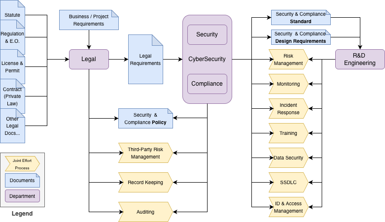

# Research: China PIPL and U.S. PADFAA / DOJ DSP compliance

> **Disclaimer:** This document is **not legal advice** and does **not** constitute legal recommendations. Any implementation or compliance program informed by it must be **reviewed and approved** by your organization’s **internal corporate legal** team (or equivalent qualified counsel).

An appendix defines roles for **Legal**, **Compliance/Security**, and **Engineering** and clarifies workflow boundaries in general compliance operations.

---

## US: PADFAA and DOJ DSP

### Background

Following EO 14117, Congress enacted the **Protecting Americans’ Data from Foreign Adversaries Act** (PADFA / PADFAA) and the DOJ issued the **Data Security Program (DSP)** to curb national-security risks from foreign access to Americans’ sensitive data. PADFA forbids data brokers from making personally identifiable sensitive data available to **foreign adversary** countries (China, Russia, Iran, North Korea) or their controlled entities, enforced by the **FTC** with civil penalties. DOJ’s DSP, binding on **U.S. persons**, prohibits or conditions **covered data transactions** that grant **countries of concern** (China, including Hong Kong/Macau, Russia, Iran, North Korea, Cuba, Venezuela) access to **bulk** sensitive personal or government-related data, requiring **CISA-aligned** controls and reporting, with **IEEPA** civil and criminal penalties. Together, PADFA targets the **data-broker** market; DSP governs **broader transactional** access.

PADFA was signed on **April 24, 2024**, and took effect **60 days** later (**June 23, 2024**). The DOJ DSP took effect on **April 8, 2025**. DOJ announced a **90-day** implementation/enforcement policy through **July 8, 2025**; after that window, DOJ began pursuing enforcement. Certain affirmative obligations (for example due diligence, audit, and reporting for **restricted** transactions) begin **October 6, 2025**.

### Executive summary — PADFAA and DOJ DSP

PADFAA and the DOJ DSP set new compliance obligations for handling sensitive U.S. personal data. The rules **restrict or prohibit** transactions involving foreign adversaries and require organizations to **audit**, **document**, and **monitor** data flows.

Key measures include strong **vendor due diligence**, **data-flow mapping**, **secure record-keeping**, and adherence to internal security policies. Organizations must align practices with regulatory requirements, train staff, and prepare for enforcement.

Baseline reviews can produce broad or generic output; a **structured, context-aware** compliance approach reduces noise and keeps risk management **actionable**.

Failure to comply may result in significant **civil or criminal** penalties—proactive governance and cross-team coordination matter.

### Legal interpretation (pending legal review)

#### 1. Targeted counterparties (whom you must not give access to)

| Dimension | PADFA | DOJ DSP |
| --- | --- | --- |
| **Foreign adversary / countries of concern** | China, Russia, Iran, North Korea | China (incl. Hong Kong/Macau), Russia, Iran, North Korea, Cuba, Venezuela |
| **Affiliated entities / actors** | Entities “controlled by” a foreign adversary (e.g. ≥20% ownership or other control) | Covered persons (organized in, owned/controlled by, or acting on behalf of the above) |

#### 2. Regulated actors (who the rules bind)

| Regime | Who is bound |
| --- | --- |
| **PADFA** | **Data brokers** — entities that make data available for value **without** collecting it directly from the individual |
| **DOJ DSP** | **U.S. persons** engaging in **covered data transactions** |

#### 3. Covered data types (what data is in scope)

- **Overlapping sensitive personal data (both):** precise geolocation; health; biometric/genetic; financial; government IDs; private communications; minors’ data; protected-class attributes; device-linkable identifiers.
- **DOJ DSP additions:** bulk sensitive personal data (volume threshold), U.S. government-related data, human **’omic** data and biospecimens, telecom/metadata indicators.

#### 4. Corresponding operations (what is barred or conditioned)

**Prohibited**

- **PADFA:** Data brokers may not sell, license, rent, trade, transfer, disclose, provide access to, or otherwise make covered data available to foreign adversaries or their controlled entities.
- **DOJ DSP:**
  - Data-brokerage that gives countries of concern / covered persons access to bulk sensitive personal or government-related data.
  - Any transaction granting those actors access to bulk U.S. human ’omic data or biospecimens.

**Restricted / conditional (DOJ DSP only)**

Vendor/supply, employment, investment, and specified cloud/IT transactions with countries-of-concern counterparties are allowed only if **robust CISA-aligned** security controls, due diligence/audits, recordkeeping, and reporting are implemented (**anti-evasion** rules apply).

---

## China: PIPL

### Background

China’s **Personal Information Protection Law (PIPL)** took effect on **November 1, 2021**. It is a comprehensive privacy statute with **extraterritorial** reach, regulating **personal information processors** (controller-like entities) that handle data of individuals in China, including from abroad. PIPL distinguishes **personal information (PI)** from **sensitive PI** and excludes **anonymized** data.

### Executive summary — PIPL and PIPIA

PIPL establishes a **GDPR-style** framework with lawful basis (often **consent**), purpose limitation, data minimization, transparency, and security measures (such as encryption).

High-risk activities—processing sensitive PI, automated decision-making, or **cross-border transfers**—require a **Personal Information Protection Impact Assessment (PIPIA)**. Overseas processors may need a **local representative** and must use an **approved outbound transfer** mechanism (CAC security assessment, certification, or standard contracts), with **localization** obligations for CIIOs and some large processors. Individuals have rights including access, rectification, deletion, objection/restriction, portability, and withdrawal of consent; the **child** threshold is **14**. Enforcement by the CAC includes rectification/suspension orders and fines up to **RMB 50 million** or **5%** of prior-year turnover, plus personal liability.

Compared to GDPR, PIPL places greater emphasis on **consent**, sets the child age at **14** (versus GDPR’s default of **16**), and explicitly excludes anonymized data. Unlike the DOJ DSP—a **national-security** rule that prohibits or conditions transfers to countries of concern—PIPL is a **general, cross-sector privacy law** governing in-scope processing and exports.

---

## PADFAA / DOJ DSP compliance requirements (pending legal review)

- **Covered data types:** Sensitive U.S. personal data includes biometric, geolocation, financial, health, and government-related information. Both PADFAA and DSP define **covered data transactions** involving these categories.
- **Foreign adversaries and covered persons:** Transactions involving entities linked to foreign adversaries (China, Russia, Iran, North Korea) or entities controlled by them fall under PADFAA restrictions.
- **Prohibited vs restricted:** Some transactions are **forbidden**; others are permitted only as **restricted** transactions under DOJ DSP rules.
- **Data-flow auditing and mapping:** Map flows, especially cross-border, to identify adversary-controlled exposure; audit regularly.
- **Record-keeping and reporting:** Maintain records of transactions, vendor contracts, and controls; report prohibited/restricted transactions and violations as required.
- **Vendor and third-party due diligence:** Contracts must support PADFAA/DSP requirements; third parties share responsibility for secure handling.
- **Enforcement and penalties:** Grace periods have applied (e.g. 90 days from effective dates); violations can carry significant civil or criminal penalties, including fines per incident.
- **Internal policies and training:** Align security policies with PADFAA/DSP; train staff; document efforts.

---

## Vendor due diligence checklist (example)

### 1. Vendor identity and ownership

- Have we verified the vendor’s legal name, country of incorporation, and ownership structure?
- Is the vendor free from ties to foreign adversaries (China, Russia, Iran, North Korea)?
- Have we screened for sanctions, export-control lists, or restricted entities?

### 2. Data handling and security

- Does the vendor process, transmit, or store sensitive U.S. personal data?
- Are encryption, access controls, and logging in place for data in transit and at rest?
- Does the vendor have SOC 2, ISO 27001, FedRAMP, or equivalent certifications?
- Have we reviewed how the vendor handles data deletion and retention policies?

### 3. Compliance and contracts

- Does the vendor agree to comply with PADFAA, DOJ DSP, and applicable privacy laws (e.g. GDPR, CCPA, PIPL)?
- Are contractual clauses in place for data security, reporting obligations, and breach notifications?
- Do we retain audit rights to assess vendor compliance?

### 4. Risk management and monitoring

- Have we conducted a security risk assessment of the vendor?
- Are there procedures for ongoing monitoring and reassessment (e.g. annual reviews)?
- Is the vendor required to disclose subcontractors or downstream service providers?

### 5. Incident response and continuity

- Does the vendor have a documented incident response plan?
- Are they required to notify us within a set timeframe if an incident occurs?
- Do they have a business continuity or disaster recovery plan in place?

---

## Appendix: Compliance workflow

The expected **roles and workflow** are summarized below (conceptual, not org-chart specific).

### Legal–engineering perspective

**Legal perspective.** “In compliance” means conforming to **all binding obligations**: statutes and regulations, licenses and permits, regulatory orders, court judgments, and relevant **contracts**. Obligations vary by jurisdiction and change over time—compliance is **scope-specific** and **continuous**, not a one-time event. Organizations demonstrate compliance through a **risk-based program** that prevents, detects, and remediates violations.

**Engineering perspective.** After Legal interprets the rules, compliance/engineering **translates** them into policies, processes, and controls, embeds them into systems (“**compliant-by-design**”), and produces **evidence** of **design** effectiveness (sensible and implemented) and **operating** effectiveness (runs reliably).

### Roles across compliance operations

#### Summary

Effective compliance is a **relay**: Legal defines **what** the law requires; Security/Compliance defines **how** to meet it and runs organizational/process controls; Development **embeds** controls and produces **evidence** they exist and work. The outcome is demonstrable design and operating effectiveness across compliance categories.

#### Legal (interpret and define requirements)

- **Governance and accountability:** Interpret applicable laws/regs; maintain a requirements register; assign policy owners and approval paths.
- **Third-party and contracts:** Draft/negotiate clauses (IP, data, audit, export), sanctions/anti-boycott language.
- **Policy management:** Approve policies/standards; set exceptions and risk-acceptance criteria.
- **Process and records:** Define legal bases, retention/destruction, cross-border rules; advise on incident notification triggers.
- **Audit and assurance:** Advise on regulator interactions, investigations, subpoenas, and certification scopes.

#### Security / Compliance (translate and operationalize)

- **Program and governance:** Convert legal obligations into controls, owners, and KPIs/KRIs; run the compliance calendar.
- **Policy and process:** Author policies/SOPs; data lifecycle practices (classification, ACLs, retention, transfer controls).
- **Data security:** Encryption, key management, tokenization, DLP, discovery/mapping, segregation.
- **Secure SDLC and change:** Gating (threat modeling, SBOM, code review, IaC/policy-as-code), SoD, change approvals.
- **Training and awareness:** Role-based training and completion tracking.
- **Controls and risk:** Preventive/detective/corrective controls; risk assessments and vulnerability management with remediation.
- **Incidents:** IR playbooks, investigations, regulator/customer notifications.
- **Monitoring and evidence:** Continuous control monitoring; evidence repositories and metrics; internal/external audits to closure.

#### Development (implement and evidence)

- **Built-in controls:** Least-privilege IAM, logging, encryption in transit/at rest, minimization, segregation within services.
- **SDLC execution:** Secure coding, dependency/SBOM hygiene, CI policy checks, IaC guardrails; document design decisions.
- **Data and process:** Classification and retention in schemas/jobs; lawful-basis and consent flows where applicable; control data exports.
- **Evidence generation:** Auditable artifacts (PRs, test results, pipeline logs, config snapshots, access reviews, tickets).
- **Operational readiness:** Current runbooks; support IR and audits with reproducible queries and exports.

### Conclusion (workflow)

When Legal’s **“what”** maps traceably to Security/Compliance’s **“how”** and Development’s **“build and prove,”** the organization can show its work: the **control**, the **owner**, and the **evidence**—on demand. That is the practical definition of **complying** and a reliable way to reduce regulatory, contractual, and operational risk.

---

## Supplement: Protecting Americans’ Data from Foreign Adversaries Act of 2024 (PADFA)

### Executive summary

PADFA prohibits data brokers from making **personally identifiable sensitive data** of U.S. individuals available to **foreign adversary** countries—China, Russia, Iran, and North Korea—or to entities **controlled** by such countries (including ≥20% ownership or other forms of control). The **FTC** enforces PADFA as a rule under the FTC Act, with civil penalties under **15 U.S.C. § 45(m)(1)(A)**. The law took effect **60 days** after enactment (**June 23, 2024**). Challenges to the division are heard exclusively in the **D.C. Circuit** within specified time limits. *(Sources: Federal Trade Commission, Congress.gov.)*

### Background and purpose

Congress enacted PADFA (**Division I** of **Public Law 118-50**) amid concern that data-broker markets enable bulk transfers of Americans’ sensitive data to foreign adversaries, posing national-security and privacy risks. PADFA establishes a bright-line federal prohibition on such transfers to specified countries or their controlled entities and routes enforcement through the FTC’s existing framework. *(Congress.gov.)*

### Effective date

PADFA’s prohibition became effective **60 days** after enactment—**June 23, 2024**. *(Congress.gov.)*

### Regulatory overview

- **Core prohibition:** A data broker may not “sell, license, rent, trade, transfer, release, disclose, provide access to, or otherwise make available” covered data to a foreign adversary country or a controlled entity. *(Congress.gov.)*
- **Who is covered:** “Data broker” includes entities that, for valuable consideration, make available data they **did not collect directly** from the individual to a third party (with enumerated exclusions). “Controlled by a foreign adversary” includes domicile/organization, **≥20%** ownership, or direction/control. *(Congress.gov.)*
- **What data is covered:** “Personally identifiable sensitive data” identifies or is reasonably linkable to an individual or device; “sensitive data” spans government IDs, health, financial, biometrics, genetic data, precise geolocation, private communications, minors’ data, protected-class information, among others. *(Congress.gov.)*
- **Foreign adversary countries:** PADFA incorporates **10 U.S.C. § 4872(d)(2)**: China, Russia, Iran, North Korea. *(Legal Information Institute.)*
- **Judicial review:** Challenges lie exclusively in the **U.S. Court of Appeals for the D.C. Circuit**, subject to **165-day** (facial) and **90-day** (action-specific) filing windows. *(Congress.gov.)*

### Enforcement

PADFA violations are enforced by the **FTC** as violations of an FTC rule under **Section 18** of the FTC Act; the Commission may use its full suite of remedies. *(Congress.gov.)*

### Penalties

Civil penalties are available under **15 U.S.C. § 45(m)(1)(A)**. The FTC’s inflation-adjusted maximum was **$53,088 per violation** (as of **2025**) and is adjusted annually. *(Federal Trade Commission.)*

### References (PADFA)

- Public Law 118-50 (H.R. 815), Division I—Protecting Americans’ Data from Foreign Adversaries Act of **2024** (statutory text; definitions; FTC enforcement; effective date). *(Congress.gov.)*
- Congress.gov bill page for H.R. 815 (division summaries; judicial-review venue and time limits).
- **10 U.S.C. § 4872(d)(2)** (foreign adversary countries incorporated by reference).
- FTC—inflation-adjusted civil penalty amounts (**2025**).
- Selected practitioner summaries on PADFA scope and data categories (secondary). *(Akin.)*

---

## Supplement: Department of Justice Data Security Program (DSP)

### Executive summary

The DOJ’s DSP, codified at **28 C.F.R. Part 202**, functions like **export controls on data**. It (i) **prohibits** U.S. persons from certain data-brokerage transactions and any human **’omic** / biospecimen transfers that would give **countries of concern** (China, Cuba, Iran, North Korea, Russia, Venezuela) or their **covered persons** access to bulk U.S. sensitive personal or U.S. government-related data; (ii) **restricts** specified vendor, employment, and investment agreements unless stringent **CISA-aligned** security requirements are met; and (iii) imposes **due diligence**, **audit**, **recordkeeping**, and **reporting** on restricted transactions. The rule took effect **April 8, 2025**, with a **90-day** enforcement policy through **July 8, 2025**, and certain audit/reporting obligations from **October 6, 2025**. Civil penalties can reach the **greater of $368,136 per violation or 2× the transaction value**; willful violations may carry **criminal** penalties (up to **20 years** and **$1,000,000**).

### Background and purpose

The DSP implements **Executive Order 14117** to mitigate national-security risks from commercial access to Americans’ **bulk** sensitive personal and government-related data by countries of concern and their covered persons.

### Effective date

Final rule published **January 8, 2025**; effective **April 8, 2025**. DOJ’s **90-day** implementation/enforcement policy through **July 8, 2025**; certain due diligence, audit, and reporting from **October 6, 2025**.

### Regulatory overview

- **Prohibited transactions (Subpart C):** (a) Data-brokerage with any country of concern/covered person; (b) other data-brokerage with onward-transfer risks; (c) transactions granting access to bulk U.S. human omic data or biospecimens. Anti-evasion and “knowingly directing” prohibitions apply.
- **Restricted transactions (Subpart D):** Vendor, employment, and investment agreements allowed only if the U.S. person meets incorporated **CISA Security Requirements** (minimization, de-identification, encryption, PETs, etc.).
- **Licensing, opinions, exemptions:** General/specific licenses, advisory opinions, exempt classes (e.g. personal communications, informational materials, certain regulatory submissions).

### Enforcement

DOJ (**National Security Division**) enforces under **IEEPA**, with **10-year** recordkeeping, annual reports for certain cloud restricted transactions, and **14-day** reports on rejected prohibited data-brokerage offers.

### Penalties

Civil penalties: **greater of $368,136 or twice the transaction value** per violation. Willful violations: up to **20 years** imprisonment and **$1,000,000** fine.

### References (DSP and related)

- **PADFAA** — practitioner updates (e.g. Carter Ledyard & Milburn LLP, Honigman, Baker McKenzie, Akin); treat as secondary unless your counsel endorses a specific memo.
- DOJ press materials: National Security Program for sensitive data; **Implementation & Enforcement Policy** (Apr. 11, 2025); FAQs; Compliance Guide (PDF).
- **Federal Register** — final rule (Jan. 8, 2025): preventing access to U.S. sensitive data by countries of concern.
- **eCFR** — [28 C.F.R. Part 202](https://www.ecfr.gov/current/title-28/chapter-I/subchapter-A/part-202) (definitions; prohibited/restricted transactions; reporting; penalties; effective date).
- Secondary industry alerts (e.g. Proskauer, White & Case) on enforcement timing and penalty levels—use as **non-primary** context only.

---

*Research notes only—see the disclaimer above.*
