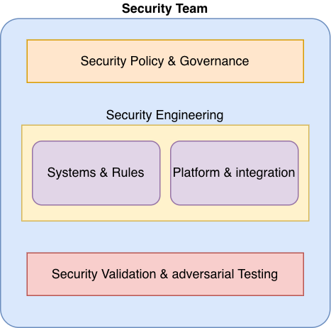

# Security as coding intelligence

## I. AI changes the development model

The shift introduced by AI is **structural, not incremental**—it fundamentally reshapes how software is created.

In practical terms, both now and in the foreseeable future:

- **Code and implementation are no longer constrained:** generation is fast, low-cost, and highly scalable.
- **Design and architecture remain limited resources:** they require judgment, experience, and domain expertise.
- **The competitive focus shifts upward:** from producing code → to designing high-quality systems.

As a result, engineering value is no longer concentrated in implementation, but in **system quality (QoS)**—architecture, resilience, adaptability, maintainability, and long-term integrity.

At the same time, a second dimension emerges. When functional delivery is no longer a bottleneck, teams gain the ability to operate at speed:

- Rapid prototyping
- Trial-and-error product and marketing validation
- Faster iteration cycles: build quickly, fail early, and refine direction

This creates a **dual competitive frontier:**

- **Depth:** delivering high-quality, secure systems
- **Speed:** accelerating exploration and decision-making

The ability to execute on **both** simultaneously defines the new advantage.

## II. Developer role: changing and changed

As the development model evolves, so does the role of the developer.

Developers are no longer primarily writing code line by line. Instead, they:

- Define specifications and intent
- Shape requirements and system structure
- Guide AI-driven implementation

Implementation is increasingly automated (e.g., tools like Speakeasy), shifting the developer’s focus away from manual coding toward higher-level responsibilities.

This results in a **dual shift** in the developer role:

- **Upward:** toward system design, architecture, and decision-making
- **Downward:** toward building high-quality, purpose-specific modules and primitives that AI can reliably reuse

Developers become:

- Designers of systems
- Architects of structure
- Experts in critical components

Without this shift, organizations risk scaling output without control—producing systems that are fast to build but fragile in foundation.

## III. Future security role and structure

### Role: strategic partner

As both the development process and the developer role evolve, the security engineer's role cannot remain static.

Security can no longer operate as a **downstream** function applied after code is written. In an AI-driven model—where code is generated rapidly and continuously—this approach becomes ineffective.

Instead, security must adapt to the new reality:

- From reviewing code → to **shaping how code is generated**
- From reactive validation → to **proactive integration**
- From isolated function → to **embedded intelligence** within the development process

This is not an optional evolution. It is a **structural requirement**.

Strategically, security engineers become:

- **Policy designers:** defining enforceable security principles
- **Technical translators:** converting policy into executable rules, patterns, and code constraints

### Model: parallel intelligence

Software development is evolving into **two coordinated systems:**

- **Development intelligence:** coding agents guided by specifications
- **Security intelligence:** policy-driven rules, validation, and enforcement

Security must integrate directly into:

- **Design:** policy-aware architecture generation
- **Specification:** secure implementation constraints
- **Code generation:** embedded security rules and approved components

Security is no longer a checkpoint—it becomes a **co-author** of code generation.

### Function: security as intentional friction

AI accelerates development but also amplifies risk. Speed without control produces fragile systems.

Security must act as **intentional friction**—not to slow progress arbitrarily, but to enforce:

- Policy-compliant outcomes
- Correct design decisions
- Safe implementation boundaries

If security remains reactive, organizations will ship faster—but with increasing systemic risk.

### Service: security as systems and rules

To support this shift, security must move beyond activities and into **systems, rules, and reusable assets** that directly shape code generation. The focus is not on reviewing outcomes, but on **controlling inputs** and enforcing consistency at scale.

#### Secure building blocks

- Provide standardized, reusable modules and libraries for security-critical components
- Ensure AI systems default to trusted implementations rather than generating from scratch

#### Automated review and validation

- Build language-specific, automated code reviewers with embedded security checks
- Integrate validation directly into the code generation and delivery pipeline

#### Dependency and supply chain control

- Maintain trusted dependency frameworks (allowlist/blocklist)
- Enforce that all generated code uses approved third-party libraries only

#### Unified development and security rulesets

Co-author comprehensive rulesets with developers, including:

- Coding standards
- Defensive programming practices
- Functional completeness requirements

Ensure these rules are **machine-enforceable** and consistently applied.

#### Domain-specific secure generation

Develop specialized secure generators and patterns for high-risk domains, such as:

- Authentication and authorization
- Database access and query handling
- Network communication

#### Configuration and runtime security enforcement

- Define and enforce secure configuration standards
- Validate environment setup, secrets management, and deployment settings during generation and runtime

#### Continuous security validation

- Expand into AI-driven penetration testing and automated security testing
- Enable continuous validation at the integration and system level

This execution model ensures that security is not applied after the fact, but is **embedded, enforced, and scalable** across all stages of AI-driven development.

### Structure: evolving the security organization

To support the new model—where security is embedded into design, specification, and code generation—the security team itself must be restructured. Traditional, stage-based security functions (e.g., review, testing, approval) are insufficient in an AI-driven, continuous generation environment.

Security must reorganize around capabilities that produce **rules, systems, and reusable intelligence**.

#### Vertical: from function-based to capability-based structure

Move away from siloed roles (e.g., AppSec, InfraSec, PenTest) toward integrated capabilities:

**Policy & governance**

- Own security principles, standards, and risk boundaries
- Define what “secure” means in enforceable terms

**Security engineering — systems & rules**

- Build rulesets, validators, and enforcement engines
- Develop secure modules, libraries, and generators

**Platform & integration**

- Embed security into developer workflows and AI pipelines
- Ensure alignment across design → spec → code generation

**Security validation & adversarial testing**

- Operate continuous testing, including AI-driven penetration testing
- Validate system-level security, not just code-level issues

#### Horizontal: specialize by domain, not just technology

Create focused ownership over high-risk areas (incomplete list):

- Identity and authentication
- Data protection and cryptography
- Network and API security
- Infrastructure and configuration security

Each domain should produce standardized patterns, libraries, and enforcement rules that AI systems can reliably apply.

#### Key structural outcome

The security team evolves from a review and approval organization into a **platform and intelligence organization:**

- Designing policy
- Encoding it into rules
- Embedding it into systems
- Scaling it through automation and AI

This structural shift ensures security remains effective in a world where software is no longer written manually, but **continuously generated**.

## IV. Practical entry point

Security teams should begin with **rule definition and enforcement**, focusing on high-impact areas:

### Code review ruleset

- Define machine-enforceable rules for secure coding
- Build automated reviewers integrated into AI code generation pipelines

### Library governance

- Establish approved (allowlist) and restricted (blocklist) libraries
- Ensure AI-generated code uses only trusted dependencies

### Standard security modules

Provide reusable, secure implementations for:

- Authentication and authorization
- Session management
- Encryption and key handling

### Network and data handling rules

Define secure patterns for:

- Network communication
- API design
- Data validation and sanitization

### Secure configuration rules

- Standardize environment, secrets, and deployment configurations
- Enforce validation during generation and runtime

### Integrated security ruleset

- Combine all rules into a unified security policy engine
- Ensure alignment across design → specification → code generation

This phased approach enables security to be embedded early and to scale effectively with AI-driven development.

## V. Summary and conclusion

AI shifts software development from **writing code** to **designing systems**. Code is abundant; structure and quality are not.

This fundamentally changes the role of security:

- From reactive validation → to **proactive integration**
- From manual review → to **rule-driven automation**
- From isolated function → to **embedded intelligence**

Security teams must evolve into **builders of rules, systems, and secure primitives** that guide AI-driven development.

**The outcome is clear:** organizations that integrate security into the generation process will achieve both speed and quality. Those that do not will achieve speed alone—at the cost of reliability and security.
