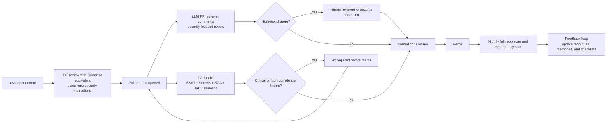

## Executive summary

LLM-assisted review helps, but it is not a substitute for scanners, gates, and humans.

General-purpose LLMs catch many common issues when the task is narrow, the prompt is structured, and the code is local. They weaken on repository-scale reasoning, patched-vs-vulnerable comparisons, and fine-grained classification. One [ICST 2025](https://conf.researchr.org/details/icst-2025/icst-2025-papers/10/Evaluating-the-Effectiveness-of-LLMs-in-Detecting-Security-Vulnerabilities) study (5,000 samples, five datasets, [CWE](https://cwe.mitre.org/index.html)-typed labels) reports modest raw LLM effectiveness (about **62.8% accuracy**, F1 0.71); the [author-hosted PDF](https://alaiasolkobreslin.github.io/files/icst25.pdf) matches that thread. Other lines of evidence—[To Err is Machine](https://openreview.net/forum?id=Q0mp2yBvb4) and [VulDetectBench](https://arxiv.org/abs/2406.07595)—report balanced accuracy near 54.5% or under 30% on harder “deep capability” tasks. [1](#ref-1), [2](#ref-2), [3](#ref-3), [4](#ref-4)

**Hybrid review** is the pattern with the strongest support: deterministic scanners or analysis for coverage, plus LLMs for triage, exploitability reasoning, fixes, and explanations. [IRIS](https://arxiv.org/abs/2405.17238) (LLM-assisted static analysis) reported 55 findings on [CWE-Bench-Java](https://github.com/iris-sast/cwe-bench-java) versus 27 for [CodeQL](https://codeql.github.com/), with slightly lower false discovery rate, plus four previously unknown issues in real code. Vendors ship similar pairings (Cursor, Copilot, Amazon Q, Semgrep, SonarQube), but **vendor** numbers are not directly comparable to peer-reviewed benchmarks. [5](#ref-5), [6](#ref-6) Representative hybrid stacks appear in references [14](#ref-14), [15](#ref-15), [16](#ref-16), [17](#ref-17), [18](#ref-18), [19](#ref-19).

**Conclusion:** Treat the LLM as an accelerator in IDE and PR workflows, not as the merge authority. [OpenSSF](https://openssf.org/) and [OWASP AISVS](https://owasp.org/www-project-artificial-intelligence-security-verification-standard-aisvs-docs/) agree on the guardrails: no secrets or regulated data in prompts, human review of AI-generated code, automated scans on every PR, and no autonomous self-approve or self-deploy. See the [OpenSSF AI code assistant instructions guide](https://best.openssf.org/Security-Focused-Guide-for-AI-Code-Assistant-Instructions). [8](#ref-8), [9](#ref-9), [10](#ref-10)

The default architecture worth standardizing: **IDE assistant + PR LLM review + deterministic SAST/secrets/SCA gate + human on risky paths + nightly full-repo scans + feedback into rules**. Pair that with the same OpenSSF and AISVS expectations for scans, human review of AI-written code, and [secure coding with AI](https://cheatsheetseries.owasp.org/cheatsheets/Secure_Coding_with_AI_Cheat_Sheet.html) habits. [8](#ref-8), [9](#ref-9), [10](#ref-10), [11](#ref-11), [12](#ref-12), [13](#ref-13)

### Key takeaways

**Research**

- LLM-only review is a **helper**, not a substitute for scanners and humans.
- It degrades on **repo-wide** context and **vulnerable vs. patched** judgment.
- **Broad** benchmarks show only **modest** accuracy—do not equate **vendor** claims with **peer-reviewed** scores.
- The supported model is **hybrid**: deterministic analysis plus LLM for triage and explanation.

**Practical recommendation**

- Ship **IDE + PR** AI with **short** security instructions before investing in custom models.
- Keep LLM output **advisory** until you measure **precision** on real PRs.
- **Gate** merges on **deterministic** CI (SAST, secrets, SCA, IaC as needed)—not on LLM comments alone.
- **Humans** review AI-generated code and high-risk changes.
- **Disallow** agents from approving or deploying their own work.
- Add **periodic** full-repo scans and **refresh** rules from what keeps recurring.

---

## What recent research shows

Recent papers agree on four patterns: uneven raw LLM skill, the cost of ignoring repo context, the lift from hybrid designs, and hard limits on “deep” analysis tasks.

**First, raw LLM skill is real but uneven.** The ICST 2025 study evaluated sixteen pre-trained LLMs on 5,000 samples, five datasets, and twenty-five CWE classes. Overall accuracy stayed modest. Models did better on intra-procedural patterns (judgments mostly inside one procedure) than on tasks that need broader program context. Step-by-step prompting raised [F1](#ref-21) on some real-world sets by up to 0.18—useful, not sufficient to drop other controls. [1](#ref-1), [2](#ref-2), [21](#ref-21)

**Second, repository context matters; naive metrics mislead.** The [ACL 2025 JITVUL](https://aclanthology.org/2025.acl-long.1490/) work shows F1 can reward “label everything vulnerable” behavior. ReAct-style agents that pulled callers, callees, and definitions beat plain or dependency-only LLMs by roughly eight to nine points on pairwise accuracy. Precision near fifty percent, over-analysis of patched code, and shaky vulnerable-vs-fixed reasoning still block unsupervised gating. [6](#ref-6)

**Third, hybrid beats prompt-only.** IRIS pairs LLMs with static analysis for whole-repo reasoning. On CWE-Bench-Java it beat CodeQL on count and false-discovery rate. That does not mean “fire the humans,” but it raises the ceiling when analysis scaffolds the model. Vendor roadmaps echo the same split: deterministic signal first, AI for triage and repair. [5](#ref-5), [14](#ref-14), [15](#ref-15)

**Fourth, hard tasks stay hard.** VulDetectBench shows strong scores on simple identification yet weak scores on deeper analysis. A separate challenge paper (To Err is Machine) reports about 54.5% balanced accuracy. CASTLE ties growing code size to falling accuracy and rising hallucination. A multi-language secure-code assessment study finds “is it vulnerable?” much easier than “which CWE exactly?” [3](#ref-3), [4](#ref-4), [7](#ref-7), [11](#ref-11)

**Conclusion:** LLMs are useful reviewers, not final authorities. Strong programs **route** work across scanners, models, and people instead of replacing the first two. [5](#ref-5), [6](#ref-6), [8](#ref-8)

---

## Effective review patterns

The table lists patterns that research and shipping tools most often support; pair it with compact repo instructions and bounded prompts.

| Approach | What it looks like | Where it helps most | Main failure mode | Evidence |
| --- | --- | --- | --- | --- |
| **Prompt-based review** | Give the model a diff, security checklist, stack constraints, and ask for exploitability, CWE, fix, and tests | Fast first-pass review in IDE or PR | Hallucinated findings and low robustness on large or cross-file changes | [3](#ref-3), [4](#ref-4), [12](#ref-12) |
| **Fine-tuned or security-tuned models** | Use a model trained or optimized for security/code analysis tasks | Better consistency than generic chat models in narrow domains | Higher maintenance cost; still weak on repo-scale reasoning without tools | [1](#ref-1), [3](#ref-3) |
| **Retrieval-augmented review** | Pull in repo rules, past triage decisions, threat-model notes, or linked docs | Org-specific rules, exploitability triage, fewer repeated mistakes | Prompt injection and stale or wrong retrieved context | [6](#ref-6), [12](#ref-12) |
| **Static-analysis + LLM hybrid** | Run deterministic SAST first, then let AI triage, explain, prioritize, or fix | Best-supported pattern today for signal and scale | Scanner blind spots remain; AI may still suppress true positives if over-optimized for noise reduction | [5](#ref-5), [14](#ref-14), [15](#ref-15), [16](#ref-16) |
| **CI/CD gating** | Run PR checks and block merges on deterministic high-confidence findings | Consistent enforcement and fast feedback | Over-gating on noisy findings slows delivery and erodes trust | [8](#ref-8), [10](#ref-10), [12](#ref-12) |
| **Agentic multi-step review** | Let the reviewer retrieve context, run tools, compare paths, and sometimes propose patches | Cross-file reasoning and deeper PR review | More moving parts, more attack surface, and brittle orchestration | [6](#ref-6), [15](#ref-15), [16](#ref-16) |
| **Human in the loop** | Require engineering review, especially for risky areas and AI-proposed fixes | Final safety, domain judgment, architecture tradeoffs | Bottleneck if everything escalates | [8](#ref-8), [10](#ref-10), [12](#ref-12) |

The OpenSSF Security-Focused Guide for AI Code Assistant Instructions turns review into instruction design: ban risky logging, reject mystery dependencies, pin versions, demand tests for security-critical paths, run CI scans, and ask the model to re-read its own answer. Cursor and Copilot consume those instructions. [GitHub Copilot code review](https://docs.github.com/en/copilot/using-github-copilot/code-review/using-copilot-code-review) only reads the first 4,000 characters of the custom instruction file, so keep files short and ordered by impact. [8](#ref-8), [9](#ref-9), [13](#ref-13)

**Conclusion:** Prefer a bounded prompt: name stack and trust boundaries, list risk classes, demand evidence and exploitability, require fixes and tests. Step-by-step framing helps only when the task stays narrow. [1](#ref-1), [8](#ref-8)

---

## Where tools help — and where they fail

Models add the most value as explainers and triagers on top of deterministic signal; their failure modes are core product risks, not edge cases.

LLM review tools shine at explanation, triage, and workflow speed. They turn “scanner said X” into “here is why X might matter, what broke, and how to fix it.” [Semgrep Assistant](https://semgrep.dev/products/semgrep-assistant), [SonarQube pull request analysis](https://docs.sonarsource.com/sonarqube-server/latest/analyzing-source-code/pull-request-analysis/), and [Amazon Q code reviews](https://docs.aws.amazon.com/amazonq/latest/qdeveloper-ug/code-reviews-github.html) (plus SAST, secrets, IaC, SCA, and deployment checks) follow that split. [14](#ref-14), [15](#ref-15), [16](#ref-16), [17](#ref-17)

**Hallucinations and false positives** stay first-class risks. GitHub’s [responsible use of Copilot features](https://docs.github.com/en/copilot/responsible-use/responsible-use-of-github-copilot-features) text warns that Copilot review can miss issues on large diffs, invent problems, and suggest code that is wrong or unsafe—treat that as the baseline for the category. [13](#ref-13)

**Context limits** bite in production. Copilot’s four-kilobyte instruction cap is one example. Amazon Q’s IDE path often defaults to **change-scoped** review unless you widen scope; see AWS on [reviewing code](https://docs.aws.amazon.com/amazonq/latest/qdeveloper-ug/code-reviews.html) and [workspace context](https://docs.aws.amazon.com/amazonq/latest/qdeveloper-ug/workspace-context.html). CASTLE links larger snippets to weaker accuracy and more hallucination—so “dump the whole repo into chat” is not a strategy without engineering around limits. [3](#ref-3), [11](#ref-11), [13](#ref-13), [18](#ref-18)

**Repo-scale reasoning** stays brittle. JITVUL documents fragile orchestration and odd behavior on patched guards. [Cursor Bugbot](https://cursor.com/docs/bugbot) posts describe many experiments before agentic, multi-pass designs stabilized—evidence that **system design**, not only base model choice, sets the ceiling. [6](#ref-6), [19](#ref-19)

**Privacy and data handling** belong in design, not footnotes. Cursor, Snyk, and GitLab each describe modes or hosting choices that change who sees code; confirm each vendor’s current posture in **Tool documentation**. OpenSSF and OWASP AISVS tell you not to ship secrets, credentials, or sensitive artifacts in prompts without approved controls. [8](#ref-8), [9](#ref-9), [10](#ref-10), [12](#ref-12)

**Adversarial context** grows with retrieval and MCP. If PR text, docs, web, or tools feed the model, treat **prompt injection** as in-scope. The [OWASP LLM prompt injection prevention cheat sheet](https://cheatsheetseries.owasp.org/cheatsheets/LLM_Prompt_Injection_Prevention_Cheat_Sheet.html) frames malicious content as a control problem. Narrow sources, tight permissions, and never let the reviewer merge its own suggestions. [8](#ref-8), [9](#ref-9), [12](#ref-12)

**Conclusion:** Benchmarks still dominate the literature; vendor KPIs are directional. The newest agentic and retrieval-heavy systems include strong preprints—use them with the same skepticism you apply to any immature signal. [6](#ref-6), [14](#ref-14), [15](#ref-15), [16](#ref-16)

---

## Tool landscape

Pick tools for fit, documented limits, and how they pair with your CI story—not for brand alone.

The short table below tracks official docs and stated limits. Split longer vendor notes into strengths versus cautions.

| Tool | Best fit | Security-relevant strengths | Main cautions |
| --- | --- | --- | --- |
| **Cursor Bugbot** | Small teams using Cursor as primary IDE assistant and PR reviewer | Agentic multi-pass review; strong repo-specific behavior via instructions; tight IDE + PR integration | Metrics are vendor-reported; still needs human review and CI gates; best used as reviewer/assistant, not sole merge gate |
| **GitHub Copilot code review** | Teams already centered on GitHub + Copilot | Native PR integration; AI suggestions in PR comments; alignment with GitHub workflows | GitHub explicitly warns about missed issues, hallucinations, and possibly insecure code suggestions; instruction file limited to 4,000 characters |
| **Amazon Q Developer code reviews (GitHub)** | AWS-centric teams using GitHub or CodeCatalyst | Combines code review with SAST, secrets, IaC, SCA, and deployment-risk checks | Auto-review on GitHub happens on PR create/reopen, not every commit unless re-triggered; default IDE scope can be narrow |
| **Semgrep Assistant** | Security-minded teams wanting hybrid SAST + LLM triage/remediation | LLM-powered triage and fixes; security-centric rules; alignment with Semgrep SAST | Commercial platform for strongest features; must tune noise reduction carefully so it does not hide true positives |
| **SonarQube AI Code Assurance** | Teams invested in Sonar quality gates and PR analysis | PR-level analysis; quality gates; AI-generated fixes for some issues | Primarily a verification/gating platform, not a conversational analyst; some AI fix features send snippets to LLM provider (Sonar documents data handling) |
| **Snyk DeepCode AI** | AppSec-heavy teams that want AI-assisted secure development and autofix | Security-specific multi-model design; broad language support; vendor-reported autofix accuracy; claims about training data; self-hosted option | Commercial/platform-oriented; best when paired with broader Snyk workflow |
| **CodeRabbit** | Teams that want AI code review beyond the diff | PR, IDE, and CLI review; learns from team feedback; knowledge base with multi-repo and external-doc context | General code-review focus rather than security-first; retrieval breadth expands attack surface and governance needs |

Also consider GitLab Duo for false-positive handling, agentic SAST resolution, and optional self-hosted models. Consider Aikido MCP when you want deterministic scans on AI-generated snippets before commit.

**Conclusion:** Match the product to your SCM, privacy bar, and whether you need conversational review or gated analysis first.

---

## Recommended small-company operating model

Favor boring hybrid controls over bespoke models or autonomous merge bots.

Stay **hybrid and conservative**: no custom fine-tuning as step one, no agent auto-merge, and no merge blocks on raw LLM text in phase one. Let the model widen coverage and speed feedback; let scanners and humans own enforcement. That stance matches benchmarks, vendor caveats, and OpenSSF / AISVS. [8](#ref-8), [9](#ref-9), [10](#ref-10)

**Minimal architecture**

**IDE:** Short OpenSSF-style instructions (libraries, banned APIs, auth, secrets, data class, logging, tests). Enable Cursor **Privacy Mode** where policy allows. Never paste secrets or personal data into prompts.

**Pull requests:** One LLM reviewer; treat comments as **advisory** until you measure precision. If budget allows signal over “another chat,” add hybrid SAST (Semgrep, SonarQube, or similar) before more agentic features.

**CI/CD:** Run **SAST, secrets, and SCA** on every PR; add IaC checks when you ship Terraform, Helm, or CloudFormation. AISVS expects human review of AI-written code and scanners with merge blocks on criticals—Sonar, GitLab, and Amazon Q can each play a role. [8](#ref-8), [10](#ref-10), [14](#ref-14), [15](#ref-15), [16](#ref-16), [17](#ref-17), [18](#ref-18)

**Human gate for high-touch code**

Require human review when changes touch:

- Authentication or authorization
- Cryptography
- Deserialization
- Command execution
- File upload or parsing
- Multi-tenant isolation
- Billing or payments
- Public endpoints that process sensitive data

Those areas mix business logic and exploitability judgments—exactly where models stall. A part-time champion who only reviews hot PRs and tunes rules can satisfy AISVS-style ownership for small teams. [8](#ref-8), [10](#ref-10), [12](#ref-12)

**Cost and privacy:** Lowest complexity is Copilot or Cursor plus cheap CI scans. Best signal per dollar is often hybrid SAST before deeper agents. For strict privacy, prefer local scanners and vendors that support self-hosting or self-hosted models on sensitive repos. [14](#ref-14), [15](#ref-15)

**Rollout**

1. **Phase one:** IDE rules, one PR bot, deterministic CI, humans on risky modules, no LLM merge blocks.
2. **Phase two:** Promote recurring lessons into org rules or memories; track precision and fix uptake.
3. **Phase three:** After evidence, try narrow autofix or agentic repair with rollback. Vendors still expect a human in those loops. [8](#ref-8), [10](#ref-10), [14](#ref-14), [15](#ref-15), [16](#ref-16), [17](#ref-17), [18](#ref-18)

**Conclusion:** Ship the loop first—assistant, PR AI, CI truth, human on heat, nightly scan, feedback—then tune.

---

## Metrics and validation plan

Measure whether security outcomes improve without wrecking delivery; avoid vanity “the model feels smart.”

AISVS points to metrics such as vulnerability density and mean time to detect. Bugbot-style posts show resolution-rate thinking. JITVUL warns that F1 alone misleads when models over-predict. [6](#ref-6), [10](#ref-10), [11](#ref-11), [12](#ref-12)

| Metric | Why it matters | How to measure |
| --- | --- | --- |
| **Precision of LLM findings** | Primary trust metric | Sample LLM comments weekly; measure % confirmed by human reviewer |
| **Fix acceptance rate** | Practical usefulness | % of LLM suggestions or autofixes accepted or merged |
| **Time to first actionable security feedback** | Shift-left speed | Minutes from PR open to first confirmed useful finding |
| **PR cycle time** | Delivery cost | Compare median PR time before/after rollout |
| **Escaped security defects** | True outcome metric | Count vulns found after merge or in prod per release or per KLOC |
| **Scanner noise ratio** | Whether gating is sustainable | False-positive rate for deterministic tools and AI-triaged findings |
| **Coverage of risky PRs** | Control completeness | % of auth/crypto/public-surface PRs reviewed by both scanner and human |
| **Instruction drift / rule freshness** | Maintenance health | Time since last rule update; % of recurring classes still reappearing |

**Three validation moves**

1. **Stepped rollout:** Pilot one or two teams against a control for four to eight weeks; watch precision, PR time, and escapes.
2. **Gold-set replay:** Rerun historical bugs and painful PRs through the toolchain; log hits, misses, and mislabels.
3. **Seeded repo:** Inject safe flaws across auth, access control, deserialization, injection, and secrets; compare layers. Pairwise vulnerable-vs-fixed pairs surface gaps F1 hides. [6](#ref-6), [7](#ref-7), [11](#ref-11)

**Conclusion:** Vendor uplift numbers are planning hints only—your baseline and defect mix define ROI. [14](#ref-14), [15](#ref-15), [16](#ref-16), [17](#ref-17), [20](#ref-20)

---

## References

In-line markers such as `[1](#ref-1), [2](#ref-2)` jump to the numbered entries below (same-page anchors). Each bibliography row also starts with an anchor `ref-N` matching that number. In the sections above, each official inline URL is linked only the **first** time that resource appears in reading order; later mentions use plain text and the same markers. Rows below still carry full URLs so nothing is orphaned.

### Peer-reviewed benchmarks and studies

1. [Understanding the Effectiveness of Large Language Models in Detecting Security Vulnerabilities (ICST 2025)](https://conf.researchr.org/details/icst-2025/icst-2025-papers/10/Evaluating-the-Effectiveness-of-LLMs-in-Detecting-Security-Vulnerabilities) — see also [researchr publication record](https://researchr.org/publication/Khare0LSAN25).
2. [Understanding the Effectiveness of Large Language Models in Detecting Security Vulnerabilities (PDF, author-hosted)](https://alaiasolkobreslin.github.io/files/icst25.pdf).
3. [To Err is Machine: Vulnerability Detection Challenges LLM Reasoning (OpenReview)](https://openreview.net/forum?id=Q0mp2yBvb4) — [arXiv:2403.17218](https://arxiv.org/abs/2403.17218).
4. [VulDetectBench: Evaluating the Deep Capability of Vulnerability Detection with Large Language Models](https://arxiv.org/abs/2406.07595) — [GitHub: Sweetaroo/VulDetectBench](https://github.com/Sweetaroo/VulDetectBench).
5. [IRIS: LLM-Assisted Static Analysis for Detecting Security Vulnerabilities](https://arxiv.org/abs/2405.17238) — [CWE-Bench-Java (GitHub)](https://github.com/iris-sast/cwe-bench-java).
6. [Benchmarking LLMs and LLM-based Agents in Practical Vulnerability Detection for Code Repositories (ACL 2025)](https://aclanthology.org/2025.acl-long.1490/) — [arXiv:2503.03586](https://arxiv.org/abs/2503.03586) (JITVUL; includes agentic retrieval and pairwise evaluation).
7. [Large Language Models for Secure Code Assessment: A Multi-Language Empirical Study](https://arxiv.org/abs/2408.06428) — [arXiv HTML](https://arxiv.org/html/2408.06428v2).

### Guidance, benchmarks, and secure-coding standards

8. [OpenSSF — Security-Focused Guide for AI Code Assistant Instructions](https://best.openssf.org/Security-Focused-Guide-for-AI-Code-Assistant-Instructions).
9. [OpenSSF — New guidance announcement (AI code assistant instructions)](https://openssf.org/blog/2025/09/16/new-openssf-guidance-on-ai-code-assistant-instructions/).
10. [OWASP AISVS — Appendix C: AI-assisted secure coding (source)](https://github.com/OWASP/AISVS/blob/main/1.0/en/0x92-Appendix-C_AI_for_Code_Generation.md) — [OWASP AISVS project](https://owasp.org/www-project-artificial-intelligence-security-verification-standard-aisvs-docs/).
11. [CASTLE: Benchmarking Dataset for Static Code Analyzers and LLMs towards CWE Detection](https://arxiv.org/abs/2503.09433) — [CASTLE-Benchmark (GitHub)](https://github.com/CASTLE-Benchmark/CASTLE-Benchmark).
12. [OWASP — LLM prompt injection prevention cheat sheet](https://cheatsheetseries.owasp.org/cheatsheets/LLM_Prompt_Injection_Prevention_Cheat_Sheet.html) — [OWASP — Secure coding with AI cheat sheet](https://cheatsheetseries.owasp.org/cheatsheets/Secure_Coding_with_AI_Cheat_Sheet.html).
13. [GitHub Docs — Using GitHub Copilot code review](https://docs.github.com/en/copilot/using-github-copilot/code-review/using-copilot-code-review) — [GitHub Docs — Responsible use of GitHub Copilot features](https://docs.github.com/en/copilot/responsible-use/responsible-use-of-github-copilot-features).

### Vendor product documentation (hybrid stacks)

14. [Semgrep — Semgrep Assistant](https://semgrep.dev/products/semgrep-assistant).
15. [Sonar — AI Code Assurance](https://www.sonarsource.com/solutions/ai/ai-code-assurance/).
16. [SonarQube Docs — Pull request analysis](https://docs.sonarsource.com/sonarqube-server/latest/analyzing-source-code/pull-request-analysis/).
17. [Amazon Q Developer — Code reviews in GitHub](https://docs.aws.amazon.com/amazonq/latest/qdeveloper-ug/code-reviews-github.html).
18. [Amazon Q Developer — Reviewing code in the IDE](https://docs.aws.amazon.com/amazonq/latest/qdeveloper-ug/code-reviews.html) — [workspace context](https://docs.aws.amazon.com/amazonq/latest/qdeveloper-ug/workspace-context.html).
19. [Cursor — Bugbot documentation](https://cursor.com/docs/bugbot) — [Cursor — Bugbot product page](https://cursor.com/bugbot).

### Industry report

20. [Veracode — 2025 GenAI Code Security Report (landing)](https://www.veracode.com/resources/analyst-reports/2025-genai-code-security-report) — [direct PDF](https://www.veracode.com/wp-content/uploads/2025_GenAI_Code_Security_Report_Final.pdf).

### Background on headline metrics and CWE labels

21. Background for the headline numbers in entries [1](#ref-1) and [2](#ref-2): [scikit-learn — Classification metrics](https://scikit-learn.org/stable/modules/model_evaluation.html#classification-metrics) defines precision, recall, and F1 (F1 is the harmonic mean of precision and recall; it often matters when vulnerable vs. not-vulnerable labels are imbalanced). MITRE Common Weakness Enumeration (CWE) is the weakness taxonomy behind “CWE classes” in that benchmark setup.

### Tool documentation

**IDE, PR, and assistant**

- [Cursor — Security](https://cursor.com/security) — Bugbot: see narrative above or [19](#ref-19).
- GitHub Copilot code review and responsible use: see [13](#ref-13).
- Amazon Q (GitHub reviews, IDE reviews, workspace context): see [17](#ref-17), [18](#ref-18).
- [CodeRabbit — Documentation](https://docs.coderabbit.ai/).

**SAST, supply chain, and platform**

- Semgrep Assistant: see narrative above or [14](#ref-14); [Semgrep documentation](https://semgrep.dev/docs/).
- [Sonar — AI Code Assurance](https://www.sonarsource.com/solutions/ai/ai-code-assurance/) — SonarQube pull request analysis: see [16](#ref-16).
- [Snyk — DeepCode AI](https://snyk.io/platform/deepcode-ai/) (product page; confirm current naming on `snyk.io`).
- [GitLab — Duo vulnerability resolution](https://docs.gitlab.com/user/application_security/vulnerability_resolution/) — [GitLab Duo](https://about.gitlab.com/gitlab-duo/).
- [Aikido — AI coding assistants (MCP)](https://help.aikido.dev/ai-and-dev-tools/aikido-mcp).
