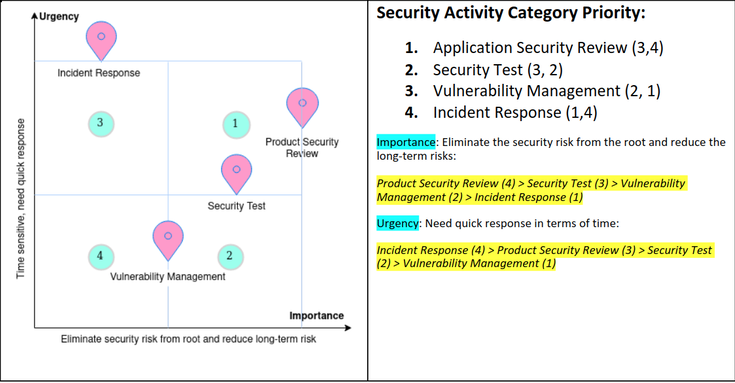

# Security tasks and prioritization

## Abstract

Security engineers are easily overwhelmed by hundreds of **seemingly trivial** issues. For example, it is hard to tell from the surface alone whether **delayed patching** for one class of exposure (e.g. a critical server-side framework issue such as **CVE-2017-5638**) should weigh above **remediating a ubiquitous logging stack** issue (e.g. **CVE-2021-44228**). **Task prioritization** is what separates an overwhelmed reviewer from a **qualified** security engineer.

A practical security engineer has a clear sense of the **core value** they must deliver and knows how to order work at both **macro** and **micro** levels.

For a security engineer, **“security” comes before “engineering.”** Protecting customers is the primary goal. From that perspective, the first qualification is knowing how to **prioritize security tasks** at macro and micro levels.

---

## The core value of security is to protect

The **core function** of security defines how you prioritize. Security **co-exists with threat**—if there is no threat, there is no meaningful “security work” in the classical sense.

The **NIST Computer Security Handbook** ([NIST Special Publication 800-12](https://csrc.nist.gov/publications/detail/sp/800-12/archive/1995-10-01)) defines **computer security** as:

> The protection afforded to an automated information system in order to attain the applicable objectives of preserving the **integrity**, **availability**, and **confidentiality** of information system resources (including hardware, software, firmware, information/data, and telecommunications).

The **priority** of a security task is measured by how much **protection** it adds when completed. The more protection a job provides, the more value it creates—hence the **higher priority**.

---

## Macro-level prioritization principles and practices

Macro prioritization focuses on **long-term protection** the security function can sustain. At this level, four essential activity families matter:

- **Product / application security review (SDLC)** — long-term prevention; eliminate or reduce risk **before** release.
- **Incident response** — handle **immediate** threats; mitigate present danger to the business and customers:
  - Zero-day / emerging vulnerability alerts
  - Build and maintain **IR playbooks**
  - Execute the playbook when incidents occur
- **Vulnerability management** — manage **exposed** risk in what you already run:
  - Residual risk acceptance and tracking
  - Open-source dependency risk
  - Supply-chain risk
- **Security test and verification** — find issues **before** they reach future customers:
  - Security QA
  - Security verification testing
  - Penetration testing
  - Security audit

A strong way to **assign priority** across these buckets is **Eisenhower’s urgent/important** principle. The chart below places macro-level work in that frame.

*Asset: `docs/assets/security-musings/security-task-prioritization.png` (working copy of `materials/security-task-prioritization.png`).*

---

## Micro-level prioritization and metrics

After macro filtering, you still have **many tasks inside one category**. The same principle applies: **more protection → higher priority**. Because “protection” differs task by task, you need **explicit metrics**.

### Product / application security reviews

- **Data classification** is the primary lever—systems that process **confidential** data generally outrank those limited to **public** data.
- **Release status** matters—a **production** service usually outranks an **in-development** prototype.
- A third tie-breaker can be **dependency breadth** or **release date**; both are defensible in practice.

Overall, the bias should be: **protect critical data for existing customers** before **less essential exposure for hypothetical future customers**, unless the business explicitly chooses otherwise.

### Security testing and vulnerability management

A **security bug bar** (severity and exploitability rubric) usually drives prioritization here. Microsoft’s [sample security bug bar](https://docs.microsoft.com/en-us/security/sdl/security-bug-bar-sample) is a rich reference (Microsoft may redirect to `learn.microsoft.com`). In practice, many teams anchor on **[CVSS 3.1](https://www.first.org/cvss/v3.1/specification-document)** and **customize** which sub-metrics matter for their environment—see the [CVSS 3.1 calculator](https://www.first.org/cvss/calculator/3.1).

### Incident response

IR is **time-sensitive**. In general:

- **Fresh, high-impact** zero-days or equivalents take precedence over stale noise.
- **Production outages** or acute customer harm need **immediate** attention.
- Non-emergency work is often ordered by **customer impact** (for example scale of affected users times severity per case)—exact formulas matter less than a **transparent**, agreed rule.

Finally, **playbooks should exist before the fire**: document response patterns under your **security architecture review** process. It is too late to invent the emergency plan when the incident has already started.

---

## Final words

Security risk **is** business risk. Prioritization of security work should **track business priorities** at macro and micro scales. That judgment is **not only a manager’s job**—it is part of what it means to be a **professional** security engineer, and it keeps the role anchored to the **value only security can provide**: **protection**.
