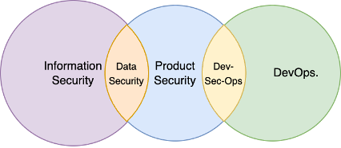
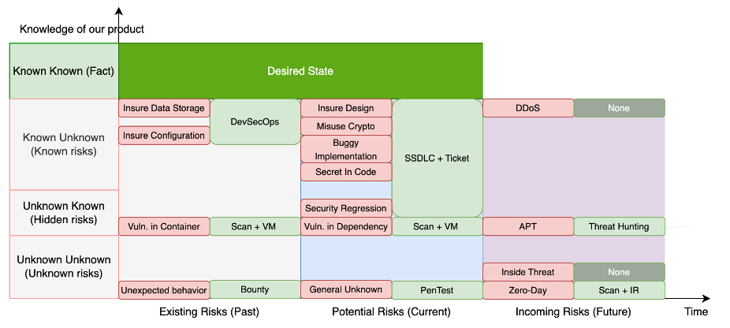
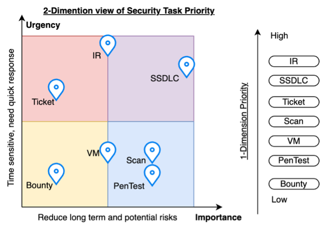

# A systematic approach to product security

## Summary

Product security is **operational discipline** embedded in how products are designed, built, shipped, and run. Two anchors make that discipline durable: **shift-left security** (find and fix issues before they become expensive incidents) and **secure design** (build controls into the architecture instead of bolting them on later).

This note lays out a **systematic** way to run the work: classify risk in ways that match how engineering actually spends time, connect each risk class to established security practices, prioritize tasks along **importance** and **urgency**, and measure whether the program is broadening coverage and deepening defenses—without sliding backward when schedules tighten.

---

## Definitions: threat, vulnerability, and risk

Threat, vulnerability, and risk are not interchangeable labels; each answers a different question. Even so, all three describe conditions that can lead to harm, service disruption, or unexpected loss.

The NIST glossary offers concise anchors:

- A **vulnerability** is a weakness that **could be exploited**.
- A **security risk** is the **effect of uncertainty** on objectives—often expressed in terms of likelihood and impact on assets.
- A **threat** is a circumstance or event with the **potential to cause adverse impact**.

For the rest of this article, **risk** is used as the umbrella term when the distinction between threat, vulnerability, and composite risk does not change the recommended action. When a control decision depends on the difference (for example, “patch a defect” vs “monitor a motivated adversary”), use the precise word.

---

## Core responsibilities

The product security function exists to **protect products and services** from material harm—confidentiality, integrity, and availability failures, safety issues where applicable, and unacceptable business impact. In practice, that means:

- **Discovering** risk through design review, testing, telemetry, and intelligence
- **Mitigating** risk with engineering changes, configuration hardening, and compensating controls
- **Eliminating** risk where that is feasible (for example, removing an unnecessary feature or dependency)
- **Making residual risk explicit** so owners can accept, transfer, or fund further work

Day to day, product security partners with the teams that actually change systems. The diagram below is a compact map of how **product security**, **DevOps**, **DevSecOps**, and **information security (InfoSec)** commonly align: product security leans toward the application and SDLC; DevSecOps leans toward runtime and platform posture; InfoSec often anchors enterprise policy, identity, and data protection expectations that customer-facing services must meet.

Typical collaboration patterns include:

- **With DevOps / platform engineering:** shared ownership of deployment pipelines, secrets handling, and production configuration drift
- **With DevSecOps:** continuous monitoring, guardrails in CI/CD, and baseline hardening that keeps pace with releases
- **With InfoSec:** enterprise security standards, customer data protection requirements, and incident coordination across product lines

---

## Why a systematic approach matters

Security work is **non-deterministic**: you cannot schedule every defect, and you cannot predict every external attack. What you can control is **process quality**—repeatable methods that improve posture over time and make regressions visible early.

A systematic program rests on three commitments:

- **Visibility:** maintain an inventory of risks and security tasks large enough to steer staffing and roadmaps
- **Leverage:** prefer durable fixes and preventive controls over one-off firefighting when trade space allows
- **Non-regression:** raise baselines as the product evolves; “we fixed it once” is not the same as “we made the class of failure unlikely to return”

---

## Recognize risk and security work

### Risk categories by project phase

Risks are not evenly distributed across the lifecycle. A practical program maps **where** risk shows up so engineers spend time on the highest-leverage phase for each issue.

| Phase | Risk category | What it is | Why it matters |
| --- | --- | --- | --- |
| **Released / production** | Existing risk | Weaknesses already present in live systems—often rooted in design tradeoffs, incomplete hardening, or latent implementation bugs | Remediation is expensive; changes require careful rollout and may affect customers directly |
| **Active development** | Potential risk | Issues not yet in production—requirements gaps, fragile design, or implementation mistakes still in review | The cheapest window to correct course; this is where SSDLC activities earn their return |
| **All projects** | Future risk | Events you cannot fully predict—**zero-day** issues in dependencies, novel attack chains, or insider scenarios | Requires preparedness: monitoring, patching discipline, IR readiness, and architectural resilience |

---

### Risk categories by knowledge state

The “known / unknown” framing is a planning tool. It tells you **what kind of evidence** you need next: documentation, review, scanning, testing, threat intelligence, or red teaming.

| Knowledge state | Meaning | Example |
| --- | --- | --- |
| **Known-known** | Facts you have validated | Security requirements are documented, tested, and signed off for a release |
| **Known-unknown** | You know the question; evidence is incomplete | “Our auth flow is complex—reviewers have not yet walked every edge case.” |
| **Unknown-known** | Information exists, but the organization has not internalized it | A scanner reports a dependency issue that no owner has triaged into a backlog item |
| **Unknown-unknown** | Blind spots nobody has named yet | A novel failure mode in a new integration surfaced only after an incident |

---

### Combined view: knowledge × lifecycle phase

The matrix below is a planning aid, not a taxonomy you must defend in a meeting. Use it to ask: **given what we know today, which countermeasures are proportionate for production vs development vs enterprise-wide readiness?**

| Knowledge state | Existing risk (production) | Potential risk (development) | Future risk (all projects) |
| --- | --- | --- | --- |
| **Known-known** | Target **desired state**; measure compliance to baselines | Prefer prevention: standards, training, and automated checks early | Fund resilience and monitoring for assumptions you have validated |
| **Known-unknown** | Configuration weaknesses, weak key hygiene, partial logging | Flawed design, incomplete input validation, inconsistent authorization | Commodity attacks such as **DDoS** where playbooks exist but tuning is incomplete |
| **Unknown-known** | Latent issues in images or services not tracked to owners | Secrets or keys embedded in repos; dependencies nobody claims | **APT**-style threats where intelligence exists externally but is not operationalized internally |
| **Unknown-unknown** | Unexpected emergent behavior under load or failover | Misuse of crypto APIs, token handling mistakes, unsafe defaults | **Zero-day** vulnerabilities and insider threats with limited prior signal |

The next figure maps **knowledge states** to **representative security tasks**—useful when building a quarterly plan or explaining why you need more than one type of assessment.

---

## Security practice areas: discovery and countermeasures

Mature teams do not rely on a single activity. They assemble **complementary** practices—each catches different classes of issues at different costs.

### Core engineering practices

- **Secure SDLC (SSDLC)**
  - Architecture and design review
  - Threat modeling
  - Security-focused code review
  - Security testing (SAST/DAST/IAST as appropriate, plus manual testing)
  - Incident response planning tied to the service’s real dependencies and data flows

- **Penetration testing** — adversarial validation of production-like environments and critical paths

- **CI/CD security scanning** — fast feedback on dependencies, secrets, IaC, and container images

- **Vulnerability management** — intake, prioritization, SLA tracking, and exception handling with owners

- **Security consultation / ticketing** — unblock developers on threat modeling questions, data classification, crypto choices, and prototype reviews

- **Incident response** — practiced execution when controls fail

### Platform and operational practices

- **DevSecOps**
  - Configuration management and drift detection
  - Key and secret lifecycle management
  - Network and identity controls (including ACLs and least privilege)

### External signal

- **Bug bounty programs** — scalable review for externally reachable attack surface, with clear scope and safe harbor

### Adjacent disciplines (often shared with InfoSec)

- **Threat hunting** — hypothesis-driven search for adversary behavior in telemetry
- **Data security** — classification, access governance, and encryption strategy
- **Security auditing** — evidence collection for internal policy and external assurance

---

## Putting the system to work

### Two-dimensional prioritization (importance × urgency)

Shift-left work is **important** because it prevents recurring classes of defects. Incident response and active exploitation are **urgent** because they threaten customers now.

SSDLC is the backbone of shift-left execution—but it does not remove the need for responsive operations. Effective teams manage the tension deliberately. For a deeper treatment of macro prioritization patterns, see [Security tasks and prioritization](security-tasks-prioritization.md).

Evaluate work on both axes:

- **Importance** — durable reduction of risk across releases (architecture, standards, training, automation)
- **Urgency** — time sensitivity driven by exposure, exploitability, or active threat

*Working copy in this repo: `docs/assets/security-musings/2d-map.png` (source: `materials/2d-map.png`).*

---

### Prevent security regression

Continuous improvement fails if every release reintroduces the same failure modes. Regression resistance comes from **systems**, not heroics:

- **Treat incidents and near misses as classes, not singletons.** When you fix an issue, budget time to hunt for siblings (shared libraries, copy-paste endpoints, parallel deployments).
- **Publish how you work.** Maintain process documentation and lightweight templates so reviews collect the same facts each time; improve the templates when lessons land.
- **Publish how to build safely.** Keep technical guidance close to the ticket queue—short, current notes beat a shelf of stale PDFs.
- **Automate baselines** where automation is accurate enough to trust: dependency updates, policy checks, and deployment gates that match the team’s risk appetite.
- **Raise standards on a schedule.** Security expectations should advance with the product; policy without enforcement becomes theater.

---

### Measurement: coverage and depth

Effectiveness is not “number of tickets closed.” It is **risk reduced** relative to what you ship and what you run. Two complementary lenses help:

**Horizontal coverage — how many projects or services are in scope?**

Prioritize breadth using business impact and data sensitivity, not convenience. A portfolio view prevents the common failure mode where only the “friendly” teams receive reviews.

**Vertical depth — how strong are the controls in each critical system?**

Depth spans layers such as:

- **Build and delivery security** — pipeline integrity, artifact provenance, and safe deployment practices
- **Runtime and data protection** — encryption, access control, logging, and detection
- **Resilience** — backup, recovery, and practiced incident response

> Portfolio mapping should be honest about **residual risk**. The goal is informed ownership, not a green dashboard.

---

## Conclusion and recommendations

A systematic product security program connects **risk clarity** to **repeatable execution**. If you are standing up or refining a program, the following actions are high leverage:

1. **Institutionalize SSDLC** for in-flight development. Use templates for design artifacts and review records so decisions are traceable and comparable across teams.
2. **Operate a dedicated security consultation path** (tickets or office hours) so small questions do not become silent wrong decisions.
3. **Formalize DevSecOps runbooks** for production: baseline images, secrets, identity, monitoring, and break-glass procedures—owned jointly with platform teams.
4. **Broaden automated scanning** across repositories and pipelines to surface **unknown–known** issues early; tune findings so developers trust the signal.
5. **Run penetration tests** against production-like environments and critical user journeys—not generic scans alone.
6. **Maintain SBOMs** (Software Bill of Materials) for production services so zero-day responses start with facts, not inventory projects.
7. **Exercise IR plans** per major service class; playbooks and checklists fail the first time under stress unless rehearsed.
8. **Build attack trees** for crown-jewel assets. They turn abstract “what if” discussions into incremental learning and measurable control gaps.

These steps do not guarantee safety—no program does—but they **stack**: each makes the next cheaper, faster, and easier to defend to leadership and customers.
