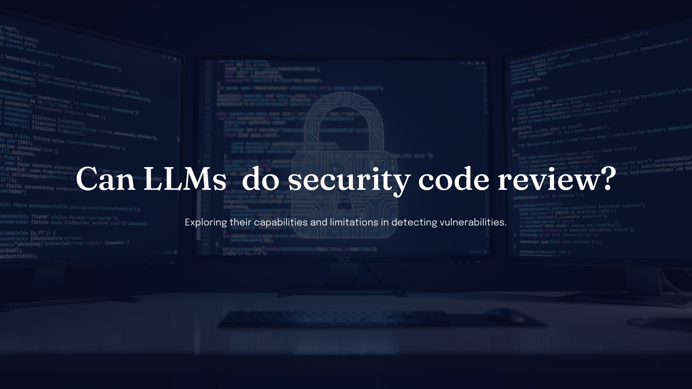

# Can LLMs do security code review?

Invited presentation on using large language models in security code review: where they help, where they fail, and how to keep human judgment and evidence in the loop.

This deck is based on publicly disclosable ideas—published practice, open discussion of AI-assisted review, and general non-secret methodology. It does not disclose confidential assessments or private vulnerability details.

## View slides

Use the arrows (or ← → / Space when the viewer is focused) to move slide by slide.

  

    
  

  

    

      <button type="button" class="talk-viewer__btn" data-action="prev">Previous</button>
      <button type="button" class="talk-viewer__btn" data-action="next">Next</button>
    

    1 / 22
    ← → or Space
  

**Download:** [PowerPoint (.pptx)](can-llms-do-security-code-review.pptx)

Related writing on this site: [Run AI-assisted security code review](../../minibooks/security-code-review/6-run-ai-assisted-security-code-review.md), [Keep AI review trustworthy](../../minibooks/security-code-review/7-keep-ai-review-trustworthy.md), [Security code review minibook](../../minibooks/security-code-review/index.md), [Security code review trends in the AI era](../../essays/security-code-review-trend-and-practice-in-ai-era.md).
