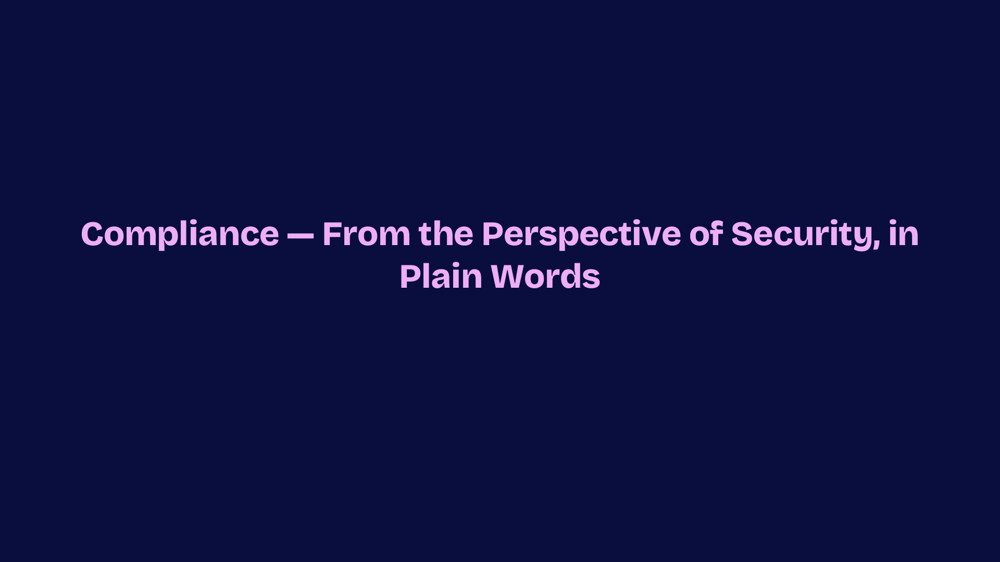

# Compliance from the perspective of security (in plain words)

Invited presentation on how security engineers can describe compliance work clearly: what controls mean in practice, how evidence shows up in engineering, and how to avoid jargon that hides risk decisions.

This deck is based on publicly disclosable material and general non-secret ideas. It is not legal advice and does not disclose confidential customer compliance assessments.

## View slides

Use the arrows (or ← → / Space when the viewer is focused) to move slide by slide.

  

    
  

  

    

      <button type="button" class="talk-viewer__btn" data-action="prev">Previous</button>
      <button type="button" class="talk-viewer__btn" data-action="next">Next</button>
    

    1 / 11
    ← → or Space
  

**Download:** [PowerPoint (.pptx)](compliance-from-the-perspective-of-security-in-plain-words.pptx)

Related writing on this site: [China PIPL and U.S. PADFAA / DOJ DSP research note](../../essays/research-china-pipl-us-padfaa-doj-dsp-compliance.md).
