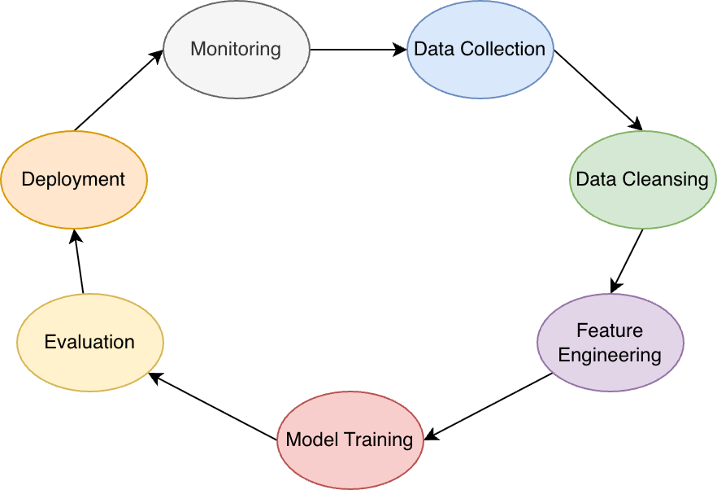

# 5. GenAI / ML fundamentals for security engineers

## Purpose of this chapter

Effective GenAI security requires a working understanding of how machine learning systems are **built**, **trained**, and **adapted** over time. Security failures often originate **before deployment**, embedded in data choices, training methods, or feedback mechanisms that shape model behavior long after release.

This chapter provides **just enough ML literacy** for security professionals to reason about risk without becoming ML engineers. The focus is on **security-relevant properties**—what changes model behavior, what persists, and where attackers can exert influence.

## The ML lifecycle at a glance (security view)

Machine learning systems introduce stages that do not exist in traditional software:

1. Data collection and preparation
2. Training or fine-tuning
3. Evaluation and selection
4. Deployment and inference
5. Feedback and continual adaptation

Security risk **accumulates across stages**; controls applied only at inference are **insufficient**.

## Training vs inference: a critical boundary

Security teams must clearly distinguish **training-time** and **inference-time** risks.

- **Training time** defines long-term behavior.
- **Inference time** exposes short-term interaction risk.
- Controls applied at inference **cannot reliably undo** mistakes introduced during training.

**Key implications:**

- Poisoned data **persists** across deployments.
- Memorization cannot be “filtered out” reliably.
- Model updates may **reintroduce** retired risks.

This boundary is foundational for **threat modeling**.

## Training data as a security asset

Training data is not configuration—it is **behavioral source code**.

**Security-relevant properties:**

- Data defines model **priorities** and **blind spots**.
- Small data changes can have **disproportionate** effects.
- Labeling errors can encode **bias** or unsafe behavior.

**Common security risks:**

- Data poisoning (malicious or accidental)
- Sensitive data inclusion
- Incomplete or unrepresentative datasets

From a security perspective, **data governance is model governance**.

## Fine-tuning techniques and their security implications

Fine-tuning adapts a base model to specific tasks or domains. Common approaches include:

- **Full fine-tuning:** updates most or all model weights.
- **Parameter-efficient fine-tuning (PEFT):** adapters, LoRA, prefix tuning.
- **Instruction tuning:** aligning responses to task patterns.

*See also (industry comparison pieces):* “Full fine-tuning, PEFT, prompt engineering, and RAG: which one is right for you?”—same tradeoff space, different risk profiles.

**Security implications:**

- Fine-tuning can embed **backdoors**.
- Adapter layers may **bypass** base-model safeguards.
- Rollbacks may **not remove** learned behavior.
- **Evaluation gaps** amplify risk.

Fine-tuning pipelines must therefore be treated as **high-risk build systems**.

## Memorization, generalization, and leakage

Models **generalize** patterns from training data—but generalization is imperfect.

**Security-relevant phenomena:**

- Memorization of rare or sensitive records
- Partial reconstruction through inference
- Statistical leakage across many queries

These risks are amplified when:

- Training data contains secrets or PII
- Models are over-parameterized
- Outputs include confidence or reasoning traces

From a security standpoint, **privacy failures are often design failures**, not bugs.

## Reinforcement learning and feedback loops

Modern GenAI systems frequently incorporate **feedback** after deployment:

- Human feedback (ratings, corrections)
- Automated feedback (tool outcomes, user behavior)
- Reinforcement learning (explicit or implicit)

*Caption inspiration: RLHF and related alignment / feedback pipelines.*

**Security implications:**

- Feedback becomes an **input channel**.
- Malicious feedback can **steer** behavior.
- **Drift** may go unnoticed without baseline controls.
- Guardrails may **weaken** over time.

Feedback ingestion must be **vetted**, **scoped**, and **monitored**, not assumed benign.

## Evaluation is not security testing

ML evaluation focuses on:

- Accuracy
- Relevance
- Fluency

Security requires **additional** dimensions:

- Misuse resistance
- Data leakage detection
- Stability under adversarial input
- Consistency across contexts

A model can pass all **functional** evaluations and still be **fundamentally unsafe**.

## Key takeaways for security teams

- **Training data** defines behavior.
- **Fine-tuning** changes risk profiles.
- **Memorization** is a persistent threat.
- **Feedback loops** create new attack surfaces.
- **Inference controls** cannot fix training failures.

Security must therefore engage **before**, **during**, and **after** model training.
